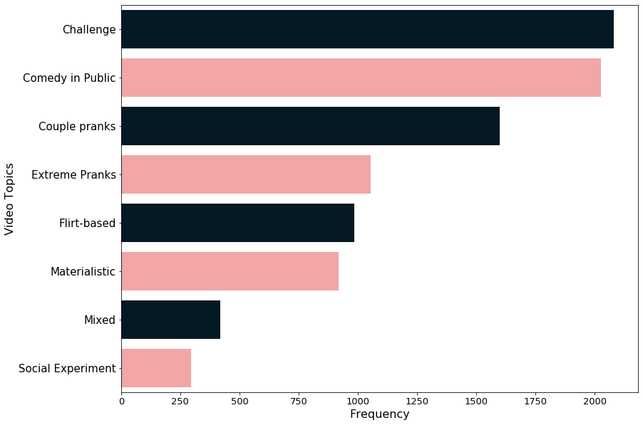
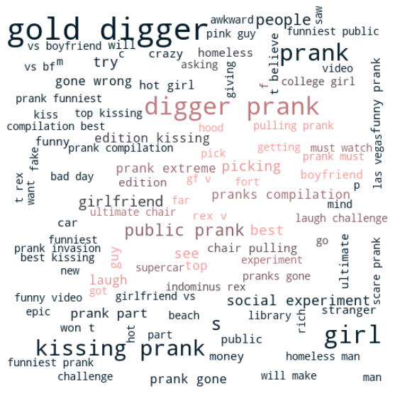

# YouTube Video CTR Predictor: Capstone Project for Flatiron School

### Business Case

Social media companies worldwide have invested countless hours into hacking the YouTube algorithm, hoping to reverse-engineer the formula for success. An upcoming tech company, **TACTIQ**, is launching a product that employs machine learning to help YouTube creators optimize their videos to perform better. For the MVP of its new app, TACTIQ is looking to include a feature that tells YouTubers if their chosen video title will result in an optimal click-through-rate for the video. To do so, they will rely on data from published videos with confirmed CTRs to train a model that can predict. My task is to explore how this can be achieved and offer a model that provides reasonably accurate predictions. When I say "reasonably accurate," it's worth noting that a video click-through-rate depends on both its title and its thumbnail. It is not possible to predict CTR with 100% accuracy based on the title alone.

### The Data

A proprietary dataset provided by **TACTIQ** includes data on 15,000+ videos from 50 prominent YouTube with subscribers between 100,000 and 7 million.

### EDA / Pre-Processing

I utilized standard NLP techniques to clean and pre-process the data: lowercase words, removed stop words, tokenized each title, etc. Additionally, I utilized LDA and NMF for topic  modeling to explore what are the most popular topics for videos in this dataset:

Topic Breakdown           |  World Cloud
:-------------------------:|:-------------------------:
  |   

### Methodology: 

#### Classification Models

I experimented with various classification approaches: binary, ternary, and expanded to multi-class classification. I binned click-through-rates in various ways
to find the most optimal class distribution. 

I trained several vanilla models - mainly linear SVM models and Naive Bayes, XGB, and a Random Forest. Each model was trained using first a Count Vectorizer,
and then TF-IDF.

I also did additional EDA after each iteration to explore if any unigrams or bigrams contribute to class bias. I removed such words and phrases for the next iteration.

Lastly, I also used GridSearch to find the best parameters for the models that gave me the highest accuracy score on my test set.

#### Regression Models

I wanted to see how accurately I can predict the exact CTR value for a video based on its title. My vanilla regressor is a Random Forest with an RMSE of 3.512.

Next, I utilized another NLP technique, word2vec, to map both words and full titles to vectors. Processing my data in this way resulted in a marginal improvement
in RMSE for an XGB Regressor (3.43) and another iteration of the Random Forest Regressor (3.50).

### Final Model

My final model is a linear classifier using SGD. Its accuracy on the training set is over 70%, which is pretty solid. It's worth mentioning that a title alone can't predict a video's CTR with 100% accuracy. Video thumbnails are hugely influential for a viewer's decision to click on a video.

### FUTURE WORK

* Create a classifier that predicts CTR based on
thumbnails.
* Train current model on CTR for different time
frames: first 48 hours, first 7 days, etc.
* Train current model with titles in different
languages.
* Train current model on titles fromdifferent
video genres such as Beauty, Lifestyle,
Gaming, etc.
